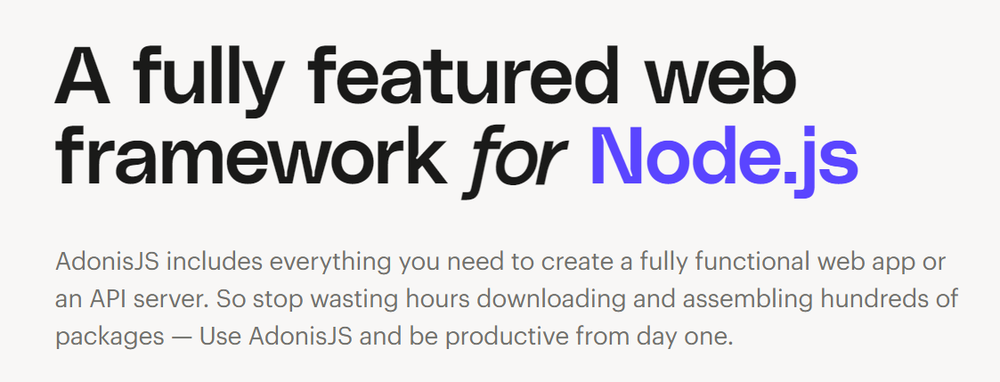

# Rationale

This is the barebone template for the microservices designed to be implemented in NodeJs.

## Technologies

### API

We use [AdoniJs](https://adonisjs.com/) as the base. It is opinionated but minimal and thoroughly maintained. The framework assembles most tools you will ever need, and the best practises. This is the note from the official site

### Database

Currently Relational databases are the first citizens.

### Other Technologies

- Caching
- Queuing
- Storage
- Logging

## Configuration

### Database

To setup the database, edit the `.env` appropiately

### Caching

We use Redis. Although you can configure your own

### Queuing

We use RabbitMQ. Although you can configure your own

### Disk

We use `local` `filesystem` as the default storage. You can configure other storage's driver such as `aws S3` or `GCS Driver` by uncommenting in the `/config/drive.ts` file.

## TODO

Add support for the NoSQL databases
